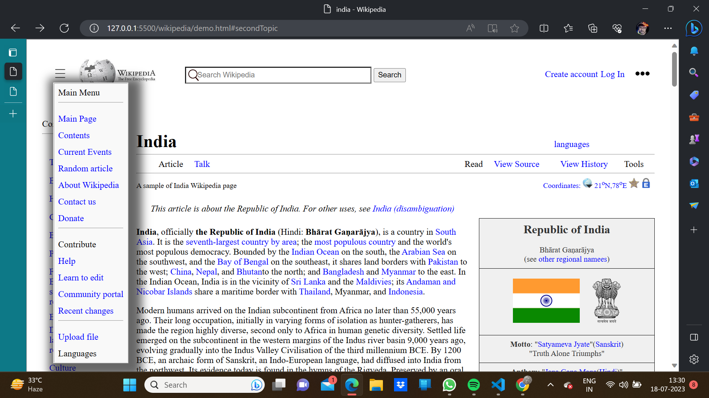
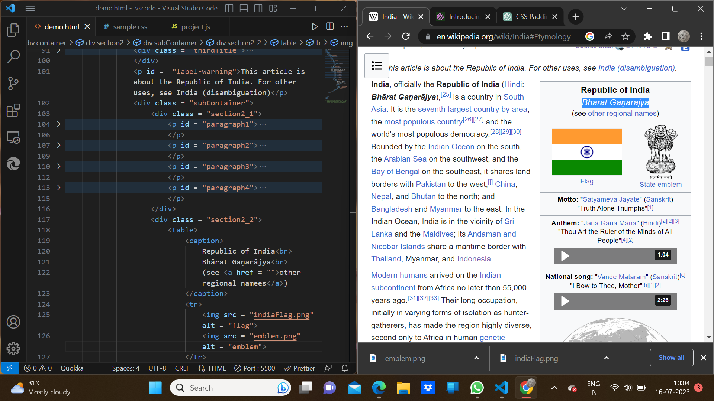
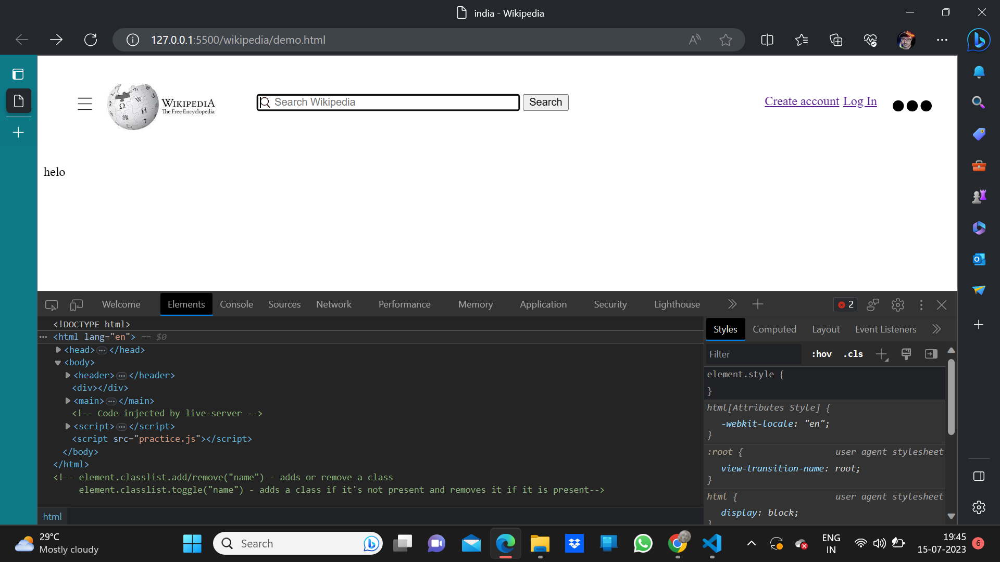

# 🇮🇳 India Wikipedia Clone

A replica of the India Wikipedia page to demonstrate and apply basic web development tools like **HTML**, **CSS**, and **JavaScript**.

## 📸 Site Images

---

## 🔧 Tech Stack

- **HTML** – Structure of the webpage  
- **CSS** – Styling and layout  
- **JavaScript** – Interactivity and dynamic features  

---

## ✅ Features

- Wikipedia-like layout and design  
- Responsive design for all screen sizes  
- Sidebar and top navigation bar  
- Clean and accessible HTML structure  

---

